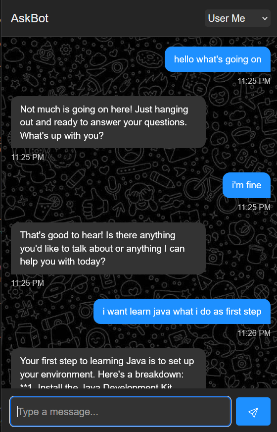
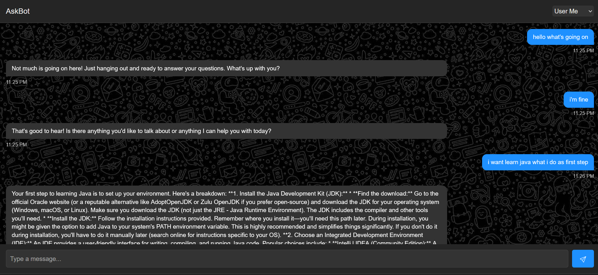

# AI Chatbot - ASKBOT

An interactive, **responsive**, and fast **AI-powered chatbot** with a modern design. The chatbot provides a seamless user experience and can be easily integrated with AI APIs for dynamic responses.

---

## Features

- **Responsive Design**: Fully optimized for desktops, tablets, and mobile devices.
- **Fast Performance**: Lightweight design ensures quick load times and smooth interactions.
- **Interactive UI**: A sleek, dark-themed interface with intuitive user interactions.
- **Customizable**: Easily modify styles and scripts to fit your needs.
- **AI-Powered Responses**: Ready to integrate with AI APIs for dynamic and intelligent conversations.
- **Cross-Browser Compatibility**: Works flawlessly on modern browsers.


---

## Technologies Used

- **HTML**: Structuring the chatbot layout.
- **CSS**: Styling the chatbot (responsive, modern design).
- **JavaScript**: Handling chatbot logic and interaction.


---

## Installation

1. Clone this repository:
   ```bash
   git clone https://github.com/yourusername/ai-chatbot.git
   cd ai-chatbot
   ```

2. Open the `index.html` file in any modern browser to launch the chatbot.

---

## How to Use

1. Type a message in the input field at the bottom of the screen.
2. Click the **Send** button or press `Enter` to send your message.
3. Wait for a response from the chatbot.

---


## Screenshot

<br>
<br>


---


## Features Highlight

- **Fast**: Optimized script ensures quicker responses.
- **Responsive**: Adapts gracefully to screens of all sizes.
- **Modern**: Clean and professional UI with a dark mode aesthetic.
- **Accessible**: Smooth scrolling and user-friendly controls.

---

## Contributing

Contributions are welcome! To contribute:

1. Fork the repository.
2. Create a new branch: `git checkout -b feature-name`.
3. Commit your changes: `git commit -m "Add feature-name"`.
4. Push to the branch: `git push origin feature-name`.
5. Create a pull request.

---

## License

This project is open-source and available under the [MIT License](LICENSE).

---

